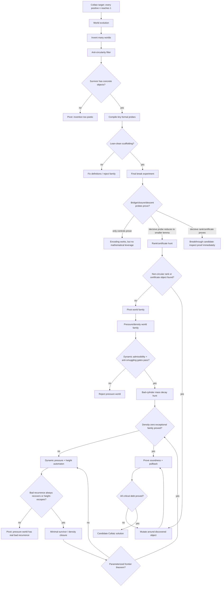

# Collatz World-Evolution Roadmap

This is Lima's current zoom-out map for deciding whether the world-evolution path is worth pursuing.

For the current endgame audit, also read:

```text
docs/COLLATZ_PROOF_DEBT_AUDIT.md
docs/COLLATZ_REFINEMENT_SIGNATURE_AUDIT.md
docs/COLLATZ_FRONTIER128_SPLIT_HARDENING.md
docs/COLLATZ_CRITICAL_Q1_KERNEL_AUDIT.md
```

## Current Position

Lima has already shown that invented worlds can make formal contact with Lean/Aristotle. That is not a Collatz result. The remaining question is whether invention can produce a non-circular object that shrinks the proof burden.

Current best world:

```text
W-0273193499 / Cylinder-Pressure Extension
```

What it has done:

```text
encoded Collatz states -> proved scaffolding/simulation/bridge-shape controls ->
completed rank/certificate hunt -> killed naive scalar rank families ->
confirmed richer structural families are formalizable ->
pivoted away from local hybrid certificates ->
proved 2-adic cylinder-pressure language is Lean-clean
proved pressure-globalization accounting is Lean-clean
proved dynamic pressure automaton evidence is Lean-clean
proved pressure-bad recurrence can be separated from height-escaping ghost recurrence
proved local pressure-plus-height survivor closure is Lean-clean
proved uniform pressure-height frontier certificate calculus is Lean-clean
proved bounded generated pressure-height frontier completeness through window 8
proved the parameterized pressure-height frontier completeness theorem
proved the actual-generator / SCC exactness / SCC drift bridge
proved route integration through no-dangerous-frontier
proved final closure architecture at theorem-shape level
```

What it has not done:

```text
expanded the remaining scaffold/certificate fields into concrete arithmetic definitions
proved global Composite Scarcity / density-zero closure without scaffold fields
proved the fully expanded Nat-level pullback to ordinary Collatz termination
proved eventual positive descent below n for every n > 1
```

## Updated Endgame

The roadmap has now compressed to one final target:

```text
for every n > 1, prove there exists k such that
0 < collatz^[k](n) < n
```

If that target is proved, the already verified descent core yields ordinary Collatz
termination by strong induction.

There are now only two serious endgames left in the repo:

```text
1. direct arithmetic route:
   prove a well-founded dyadic refinement + affine rewrite closure theorem

2. pressure-height route:
   eliminate the remaining scaffold fields and prove the concrete Nat-level
   pressure-height exit / pullback theorem
```

The current best bet is now a hybrid leaning toward route 2:

```text
use the direct odd frontier only to compress the remaining obstruction to a
finite kernel, then finish through the pressure-height proof spine
```

That shift is justified by the current state:

```text
the exact refinement-signature audit shows that shallow finite tree shape is still too
weak, but the recurrent unresolved core projects exactly back to the same 13 unresolved
mod-128 residue cylinders.

So the direct frontier is still valuable, but now mainly as a way to identify the exact
finite kernel / cylinder family that the pressure-height route must kill concretely.

The newest persistence audit sharpens that finite kernel again:

```text
the 13 unresolved mod-128 cylinders persist through modulus 65536,
but they collapse into three exact growth archetypes:

A = {27, 31, 63, 103, 111}
B = {39, 47, 71, 79, 91, 95, 123}
C = {127}
```

So the direct-route endgame may now reduce to excluding infinite unresolved branches for
three archetypes rather than thirteen unrelated residue cases.

The frontier split hardening upgrades part of this from search to theorem:

```text
39, 79, 95, and 123 now have Lean-clean 13-step descent theorems.

So the live theorem-level parent frontier is:
27, 31, 47, 63, 71, 91, 103, 111, 127 mod 256

grouped as:
A_parent = {27, 31, 63, 103, 111}
B_parent = {47, 71, 91}
C_parent = {127}
```

The newest kernel alignment sharpens the hybrid route again:

```text
the theorem-backed mod-128 child reductions and the mod-256 refinement-signature audit
now agree on a two-class coarse kernel:

K1 roots = {27, 103, 127}
K2 roots = {31, 47, 63, 71, 91, 111}

and the theorem-backed reduction targets from
39, 47, 71, 79, 91, 95, 123 mod 128
all land inside K2.
```

So the best current roadmap reading is:

```text
use theorem-level frontier reduction to compress the odd arithmetic debt into
a two-class coarse kernel, then finish through explicit kernel exactness/drift
inside the pressure-height spine
```

The newest factorization hardenings make this more concrete:

```text
the unresolved odd frontier is now theorem-factorized across two layers:

mod 128 frontier
-> exact one-child-or-two-child dependence on mod-256 families

mod 256 frontier
-> exact two-child dependence on mod-512 families

mod 512 frontier
-> 12 one-child reductions to mod-1024 families because the sibling already descends

So the frontier no longer looks like a collection of ad hoc residue lemmas.
It now looks like a genuine binary refinement kernel whose closure/exactness/drift
must be proved as a finite object.
```

The newest search-only lift-signature audit supports the same roadmap read:

```text
one deeper unresolved layer still compresses to a tiny number of coarse classes:

open mod-256 residue set -> 3 classes
open mod-512 residue set -> 4 classes
open mod-1024 residue set -> 3 nontrivial coarse classes and 3 nontrivial exact profiles
```

This is not a proof artifact.
It is one more reason to treat the endgame as finite-kernel control rather than
indefinite residue hunting.
```

```text
the direct frontier is already finite and named
the pressure-height route already has theorem-shaped exactness/drift -> no-dangerous-frontier
the transition compass suggests the unresolved tree may admit finite-state
compression instead of a brand-new scalar rank
```

## Immediate Lean Snapshot

This roadmap is the zoomed-out map.

The immediate local Lean hardening state is:

```text
descent core over Nat: proved
compressed target: for every n > 1, produce k with 0 < collatz^[k](n) < n

concrete exit families currently proved:
- even n
- n ≡ 1 mod 4, n > 1
- n ≡ 3 mod 16
- n ≡ 11 or 23 mod 32
- n ≡ 7, 15, or 59 mod 128
- n ≡ 287, 347, 367, 423, 507, 575, 583, 735, 815, 923, 975, or 999 mod 1024
- n ≡ 383, 615, or 2587 mod 4096

general refinement theorem currently proved:
- if all dyadic children of a family descend, then the parent family descends
```

Search-only compass signal:

```text
A single-family affine rewrite compass, built from the proved Lean family rules, already
composes descent certificates for some mod-256 roots such as 39, 79, 95, and 123.

After adding the new 1024 and 4096 extension rules, that root-level frontier does not
change. A separate refinement compass now shows that the unresolved parents split into
two visible dyadic archetypes, and a transition compass compresses the unresolved tree
into a small number of profile classes across 4096/8192/16384.

This is still not a proof artifact. It is guidance for the next hardening step.
```

Newest hardening update:

```text
The remaining nine mod-256 parent roots have now been packaged into explicit Lean-clean
parent-closure probe files. Each probe contains:
- the proved dyadic partition theorem
- fully checked direct mod-4096 child proofs already known locally
- only the genuinely unresolved mod-4096 child closures as holes

So the frontier is no longer just "some unresolved residues"; it is a finite family
of theorem-shaped parent closure obligations.

At the moment Aristotle is queue-blocked ("too many requests in progress"), so live
submission is throttled by account state rather than by probe quality.
```

Newest live parent-probe sharpening:

```text
the representative K2 parent probe for 256*t + 31 has now produced a real artifact bundle.

It does not close the parent, but it isolates the exact K2 mod-4096 open child set:
31, 543, 799, 1055, 1567, 2079, 2847, 3103, 3615, 3871

The already closed K2 siblings are:
287, 1311, 1823, 2335, 2591, 3359

Local verification confirms the same stall mechanism:
4096*t + 31 reaches 19683*t + 155 after 21 deterministic steps,
with coefficient still above 4096 and odd, so parity dependence appears before descent.
```

That sharpens the roadmap again:

```text
the next direct local target inside K2 is the 10-child recurrent mod-4096 family,
not the parent 256*t+31 as a single opaque theorem
```

Local deterministic checking already splits that K2 child family into three archetypes:

```text
543, 799, 1567, 2079, 3871 -> 6561*t + c after 20 deterministic steps
31, 2847, 3103, 3615 -> 19683*t + c after 21 deterministic steps
1055 -> 59049*t + 15227 after 22 deterministic steps
```

So the direct-route endgame is sharper again:

```text
close three recurrent K2 mod-4096 child archetypes,
or prove they all fold into one higher-level kernel theorem
```

And one parity split deeper, the archetypes already show a simple transition ladder:

```text
6561  -> 6561 or 19683
19683 -> 19683 or 59049
59049 -> 59049 or 177147
```

So the direct-route roadmap is narrowing again:

```text
the missing object may be a finite-state 3-adic ladder control theorem
for the K2 kernel, rather than 10 independent child closures
```

The first parity split is also exactly balanced:

```text
at each current K2 ladder state,
one parity child stays on the same odd coefficient
and the other moves to 3 times that coefficient
after forced even normalization
```

So the roadmap is now even sharper:

```text
the next theorem is not just "control a ladder",
but "control an exact same-or-times-3 branching law on that ladder"
```

Newest kernel sharpening:

```text
the first explicit quotient candidate is now in hand:
- a 9-state coarse kernel with one 8-state nontrivial SCC
- refining to 10 states by modulus 32768

the explicit critical obstruction is also now arithmetic:
- the rare Q1 self-cloning branch projects onto exactly the 19 open mod-256 classes
- those classes obey exact child-count laws
  1 -> 1
  7 -> 8 -> 9
  22 -> 29 -> 37
- those laws are now packaged in a Lean-clean three-state quotient
  A / B / C via scripts/run_collatz_critical_q1_kernel_quotient_hardening.py
- the checked phase-aware prefix is now also Lean-clean via
  scripts/run_collatz_critical_q1_phase_kernel_hardening.py:
  A: 1 -> 2 -> 3 -> 4 -> 8
  B: 9 -> 18 -> 28 -> 39 -> 78
  C: 37 -> 74 -> 120 -> 176 -> 352
  with four-step dyadic factors
  1/2
  13/24
  22/37
- the next periodic extension is also Lean-clean via
  scripts/run_collatz_critical_q1_phase_periodicity_hardening.py:
  262144 -> 524288 mixed
  524288 -> 1048576 all-bifurcate
  1048576 -> 2097152 mixed
  2097152 -> 4194304 mixed
  with checked two-bit return factors
  2/3, 39/56, 11/15
  then
  13/16, 43/52, 595/704
  then
  19/32, 193/312, 917/1408
- and exact dyadic-normalized class factors
  1/2
  4/7 then 9/16
  29/44 then 37/58
all strictly below 1
```

So the roadmap is no longer:

```text
"hunt vaguely for a final kernel theorem"
```

It is now:

```text
1. make the kernel phase-aware and exact
2. prove that the actual critical Q1 shadow obeys an all-depth phase-aware
   finite phase machine extending the checked A/B/C prefix
3. use the already Lean-clean abstract A/B/C subcriticality algebra together with
   the checked phase-prefix contraction
4. pull that finite theorem through the pressure-height spine
```

Immediate unresolved arithmetic frontier:

```text
direct-family theorem frontier:
27, 31, 39, 47, 63, 71, 79, 91, 95, 103, 111, 123, 127 mod 128

single-family rewrite frontier:
27, 31, 47, 63, 71, 91, 103, 111, 127 mod 256

parent-closure probe frontier:
- 31, 47, 63, 71, 91, 111 each reduce to 10 unresolved mod-4096 children after inlining 6 direct children
- 27, 103, 127 each reduce to 15 unresolved mod-4096 children after inlining 1 direct child
```

Updated roadmap from here:

```text
Phase A. preserve the proved base
- descent core
- concrete exit families
- parent-closure theorem
- pressure-height endgame architecture

Phase B. close one remaining bridge
- either refinement + rewrite well-foundedness
- or concrete pressure-height scaffold elimination into Nat arithmetic

Phase C. derive universal eventual descent
for every n > 1, ∃ k, 0 < collatz^[k](n) < n

Phase D. apply the descent core
universal eventual descent -> ordinary Collatz termination
```

## Flow Diagram



## Question Stack

1. Can the world define its objects without assuming Collatz?
2. Can the world simulate Collatz one step at a time?
3. Can the bridge back to natural numbers avoid restating the target?
4. Can a conditional descent/certificate theorem be proved?
5. Can Lima invent the actual rank/certificate object?
6. Is that object non-circular?
7. Does it reduce proof debt below the original theorem?
8. Can all critical bridge and closure debt be proved formally?

## Decision Gates

### Pursue

Continue this path if at least one of these happens:

```text
- A decisive bridge/closure/descent probe is proved.
- A decisive failed probe exposes a smaller named lemma.
- A non-circular certificate/rank/invariant candidate is produced.
- The same lineage survives mutation with decreasing proof debt.
```

### Pivot

Stop this world family if:

```text
- Only definitional/control probes prove.
- Hard probes simply restate global Collatz termination.
- The rank/certificate object is equivalent to reachability.
- Failures do not expose a smaller lemma than Collatz itself.
```

## Where We Are Now

```text
World evolution: passed
Scaffolding probes: passed
Final break experiment: mostly completed
Exact Collatz pullback target: blocked
Rank/certificate hunt: completed, but direct existence probe blocked
Candidate scalar rank-family gauntlet: completed, mostly negative
Structured rank-family wave: completed, mixed but informative
Hybrid certificate-family wave: completed, positive local syntax / negative coarse signature completeness
Compositional certificate wave: completed, positive local composition / negative short-block descent
Coverage-normalization hunt: completed, coverage statements formalized but syntactic/forced-extension mechanism rejected
Cylinder-pressure wave: completed, dynamic admissibility and anti-smuggling gates passed
Pressure-globalization wave: completed, split-tree accounting and density-zero targets passed
Pivot portfolio wave: completed, density/ecology route selected over inverse-tree as main engine
Composite scarcity viability gate: completed, theorem-shaped route passed 8 / 8 probes
Composite scarcity theorem local gates: completed, parameterized scarcity/recovery/survivor gates passed 10 / 10 probes
Global forcing hunt: completed, explicit alternatives force progress but static legality admits persistent bad frontiers
Dynamic pressure automaton: completed, pure residue pressure has ghost recurrence
Height-lifted pressure automaton: completed, checked recurrent bad components height-escape
Pressure-plus-height survivor closure: completed, local minimal-survivor closure passed 10 / 10 probes
Pressure-height frontier certificate calculus: completed, uniform no-dangerous-frontier theorem passed 12 / 12 probes
Bounded generated frontier completeness: completed, substantive window-8 kill-test probes passed 13 / 13 submitted jobs; 2 redundant audit probes missing from submission-cap artifact
Parameterized pressure-height completeness schema: completed, all-depth conditional theorem passed 13 / 13 probes
Actual-generator bridge: completed, reduced invariant satisfaction to uniform SCC drift/exactness, 13 / 13 probes
SCC exactness tranche: completed, exact coverage and unchecked-obstruction guards passed 13 / 13 probes
SCC drift tranche: completed, positive-drift and nonpositive-obstruction guards passed 13 / 13 probes
Route integration: completed, exactness+drift compose through R23/R22 to no-dangerous-frontier, 13 / 13 probes
Final closure architecture: completed, no-dangerous-frontier composes through density closure and ordinary pullback at theorem-shape level, 13 / 13 probes
Current bottleneck: final architecture still uses certificate/scaffold fields that must be expanded into concrete arithmetic definitions
Next phase: proof hardening, finite-kernel compression, and scaffold elimination
```

## Next Phase

The pivot away from the current Alien State-Space / hybrid-certificate lineage has started. The cylinder-pressure and pressure-globalization waves proved that 2-adic residue cylinders, dynamic parity admissibility, affine block transport, pressure accounting, legal refinement, split-tree bad-frontier accounting, and density-zero targets can be stated without directly assuming reachability.

```text
current candidate world family:
- 2-adic cylinder-pressure / density transport / minimal-survivor ecology

next gates:
- parity/residue-block dynamic admissibility implies pressure recovery or height escape
- pressure-bad residue recurrences are all height-escaping, not dangerous bounded cycles
- height escape is incompatible with persistent minimal-survivor obstruction
- actual Collatz residue generator satisfies the parameterized pressure-height invariant
- uniform SCC drift/exactness for the actual pressure-height generator
- route integration from SCC exactness/drift to no-dangerous-frontier
- density-zero exceptional-family theorem from global composite scarcity
- ordinary Collatz pullback from the pressure-height no-dangerous-frontier theorem
- expansion of final closure certificates into concrete arithmetic proofs
```

The local parameterized gates have now passed: strong scarcity implies subcritical bad mass, depth-indexed scarcity projects to density contraction, bounded recovery can beat odd debt, weak scarcity/equal recovery are insufficient, and survivor descent composes while forbidding self-loops. The adversarial global-forcing hunt then separated the real issue: explicit dynamic alternatives do force progress, but static legality alone admits legal persistent bad frontiers such as all-odd/no-recovery, equal-recovery, and weak-scarcity cases. The dynamic-pressure automaton sharpened this again: pure residue pressure has real bad recurrences, including the 2-adic ghost cycle -2 <-> -1, but the height lift classifies the checked recurrent bad components as Archimedean-height-escaping rather than dangerous nonexpanding cycles. The pressure-height survivor closure wave then proved the local minimal-survivor gate: pressure-bad alone can persist, but height escape contradicts minimal persistence, and the composite exits kill local minimal bad obstruction. The frontier certificate wave then proved that if every component has one of the closure exits, there is no dangerous frontier. The bounded completeness kill test then generated actual pressure-height frontiers through window 8 and found no dangerous or unchecked recurrent bad component; every recurrent bad component was height-certified. The parameterized completeness wave then proved the conditional all-depth schema: if a generator satisfies the pressure-height invariant, then no dangerous frontier exists at arbitrary depth. The actual-generator bridge then proved that invariant satisfaction reduces to uniform positive drift plus exact SCC coverage for generated pressure-height SCCs. The SCC gauntlet separately verified exactness and drift tranches, with adversarial unchecked and zero-drift SCCs rejected. The route integration tranche then composed exactness+drift through R23/R22 to no-dangerous-frontier while explicitly preserving the density-zero and ordinary-pullback debts. The final closure wave then verified the theorem-shape architecture from no-dangerous-frontier through density-zero / Composite Scarcity and ordinary pullback, while rejecting obvious termination/reachability smuggling.

This is no longer an invention roadmap. The current named work is proof hardening: replace the remaining certificate/scaffold fields in the final architecture with concrete arithmetic definitions and proofs. If hardening succeeds, the route can become a genuine formal Collatz proof attempt. If hardening fails, the failure should name the exact unexpandable field: density closure, finite/base coverage, survivor-family elimination, or ordinary Nat pullback.

## Next Aristotle Wave Constraint

The next Aristotle wave should use **13 probes or fewer** and must not be a larger bounded-window evidence run.

Required scope:

```text
Target: proof hardening and scaffold elimination

Acceptable wins:
- a theorem replacing final closure certificate fields with concrete pressure-height definitions
- a theorem deriving density-zero / Composite Scarcity from no-dangerous-frontier without a density field
- a theorem deriving finite/base coverage without assuming termination
- a theorem over Nat pulling the pressure-height closure back to ordinary Collatz termination
- an audit proving the final theorem statement has no scaffold fields

Not enough:
- another theorem-shape wave that keeps certificate fields
- another proof over Boolean report records only
- another anti-circularity probe without expanding a field
- a final theorem that assumes density closure, finite/base coverage, reachability, or termination
```

Suggested 13-probe shape:

```text
1. inline no-dangerous-frontier into the density closure statement
2. replace densityZero Bool with a concrete density-zero predicate
3. replace compositeScarcity Bool with a concrete scarcity bound
4. derive no positive-density survivor family from the concrete predicates
5. replace finiteBaseCoverage Bool with explicit finite/base theorem obligations
6. define the ordinary Nat-level Collatz orbit predicate
7. prove a nonterminating Nat orbit induces a pressure-height survivor object
8. prove the survivor object contradicts concrete density closure
9. prove ordinary Collatz termination over Nat from the expanded lemmas
10. reject any density proof using termination or reachability
11. reject any pullback proof using the final theorem as an assumption
12. prove the final theorem has no scaffold/certificate fields
13. expose the remaining unexpanded field, if any
```

Hybrid variant now worth prioritizing:

```text
1. prove the 13 mod-128 frontier splits into 9 true parent roots mod 256
2. define a finite kernel for the unresolved return dynamics of those parents
3. prove exact SCC coverage on that kernel
4. prove positive drift on that kernel
5. restate no-dangerous-frontier directly from those explicit kernel predicates
6. derive concrete density/scarcity closure from no-dangerous-frontier
7. prove finite/base coverage below the kernel bound
8. pull the concrete closure statement back to eventual positive descent over Nat
```
