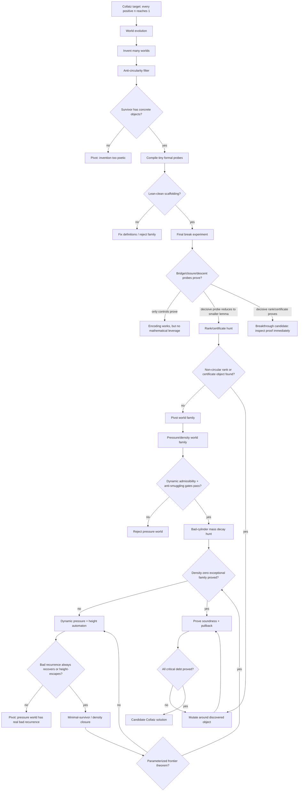

# Collatz World-Evolution Roadmap

This is Lima's current zoom-out map for deciding whether the world-evolution path is worth pursuing.

## Current Position

Lima has already shown that invented worlds can make formal contact with Lean/Aristotle. That is not a Collatz result. The remaining question is whether invention can produce a non-circular object that shrinks the proof burden.

Current best world:

```text
W-0273193499 / Cylinder-Pressure Extension
```

What it has done:

```text
encoded Collatz states -> proved scaffolding/simulation/bridge-shape controls ->
completed rank/certificate hunt -> killed naive scalar rank families ->
confirmed richer structural families are formalizable ->
pivoted away from local hybrid certificates ->
proved 2-adic cylinder-pressure language is Lean-clean
proved pressure-globalization accounting is Lean-clean
proved dynamic pressure automaton evidence is Lean-clean
proved pressure-bad recurrence can be separated from height-escaping ghost recurrence
proved local pressure-plus-height survivor closure is Lean-clean
proved uniform pressure-height frontier certificate calculus is Lean-clean
proved bounded generated pressure-height frontier completeness through window 8
```

What it has not done:

```text
proved the parameterized pressure-height frontier completeness theorem
proved global Composite Scarcity / density-zero closure
proved the sound pullback to ordinary Collatz termination
```

## Flow Diagram



## Question Stack

1. Can the world define its objects without assuming Collatz?
2. Can the world simulate Collatz one step at a time?
3. Can the bridge back to natural numbers avoid restating the target?
4. Can a conditional descent/certificate theorem be proved?
5. Can Lima invent the actual rank/certificate object?
6. Is that object non-circular?
7. Does it reduce proof debt below the original theorem?
8. Can all critical bridge and closure debt be proved formally?

## Decision Gates

### Pursue

Continue this path if at least one of these happens:

```text
- A decisive bridge/closure/descent probe is proved.
- A decisive failed probe exposes a smaller named lemma.
- A non-circular certificate/rank/invariant candidate is produced.
- The same lineage survives mutation with decreasing proof debt.
```

### Pivot

Stop this world family if:

```text
- Only definitional/control probes prove.
- Hard probes simply restate global Collatz termination.
- The rank/certificate object is equivalent to reachability.
- Failures do not expose a smaller lemma than Collatz itself.
```

## Where We Are Now

```text
World evolution: passed
Scaffolding probes: passed
Final break experiment: mostly completed
Exact Collatz pullback target: blocked
Rank/certificate hunt: completed, but direct existence probe blocked
Candidate scalar rank-family gauntlet: completed, mostly negative
Structured rank-family wave: completed, mixed but informative
Hybrid certificate-family wave: completed, positive local syntax / negative coarse signature completeness
Compositional certificate wave: completed, positive local composition / negative short-block descent
Coverage-normalization hunt: completed, coverage statements formalized but syntactic/forced-extension mechanism rejected
Cylinder-pressure wave: completed, dynamic admissibility and anti-smuggling gates passed
Pressure-globalization wave: completed, split-tree accounting and density-zero targets passed
Pivot portfolio wave: completed, density/ecology route selected over inverse-tree as main engine
Composite scarcity viability gate: completed, theorem-shaped route passed 8 / 8 probes
Composite scarcity theorem local gates: completed, parameterized scarcity/recovery/survivor gates passed 10 / 10 probes
Global forcing hunt: completed, explicit alternatives force progress but static legality admits persistent bad frontiers
Dynamic pressure automaton: completed, pure residue pressure has ghost recurrence
Height-lifted pressure automaton: completed, checked recurrent bad components height-escape
Pressure-plus-height survivor closure: completed, local minimal-survivor closure passed 10 / 10 probes
Pressure-height frontier certificate calculus: completed, uniform no-dangerous-frontier theorem passed 12 / 12 probes
Bounded generated frontier completeness: completed, substantive window-8 kill-test probes passed 13 / 13 submitted jobs; 2 redundant audit probes missing from submission-cap artifact
Parameterized pressure-height completeness schema: completed, all-depth conditional theorem passed 13 / 13 probes
Actual-generator bridge: completed, reduced invariant satisfaction to uniform SCC drift/exactness, 13 / 13 probes
SCC exactness tranche: completed, exact coverage and unchecked-obstruction guards passed 13 / 13 probes
SCC drift tranche: completed, positive-drift and nonpositive-obstruction guards passed 13 / 13 probes
Route integration: completed, exactness+drift compose through R23/R22 to no-dangerous-frontier, 13 / 13 probes
Current bottleneck: no-dangerous-frontier has not yet been pulled through density-zero / Composite Scarcity to ordinary Collatz termination
Next phase: final global closure and ordinary Collatz pullback
```

## Next Phase

The pivot away from the current Alien State-Space / hybrid-certificate lineage has started. The cylinder-pressure and pressure-globalization waves proved that 2-adic residue cylinders, dynamic parity admissibility, affine block transport, pressure accounting, legal refinement, split-tree bad-frontier accounting, and density-zero targets can be stated without directly assuming reachability.

```text
current candidate world family:
- 2-adic cylinder-pressure / density transport / minimal-survivor ecology

next gates:
- parity/residue-block dynamic admissibility implies pressure recovery or height escape
- pressure-bad residue recurrences are all height-escaping, not dangerous bounded cycles
- height escape is incompatible with persistent minimal-survivor obstruction
- actual Collatz residue generator satisfies the parameterized pressure-height invariant
- uniform SCC drift/exactness for the actual pressure-height generator
- route integration from SCC exactness/drift to no-dangerous-frontier
- density-zero exceptional-family theorem from global composite scarcity
- ordinary Collatz pullback from the pressure-height no-dangerous-frontier theorem
```

The local parameterized gates have now passed: strong scarcity implies subcritical bad mass, depth-indexed scarcity projects to density contraction, bounded recovery can beat odd debt, weak scarcity/equal recovery are insufficient, and survivor descent composes while forbidding self-loops. The adversarial global-forcing hunt then separated the real issue: explicit dynamic alternatives do force progress, but static legality alone admits legal persistent bad frontiers such as all-odd/no-recovery, equal-recovery, and weak-scarcity cases. The dynamic-pressure automaton sharpened this again: pure residue pressure has real bad recurrences, including the 2-adic ghost cycle -2 <-> -1, but the height lift classifies the checked recurrent bad components as Archimedean-height-escaping rather than dangerous nonexpanding cycles. The pressure-height survivor closure wave then proved the local minimal-survivor gate: pressure-bad alone can persist, but height escape contradicts minimal persistence, and the composite exits kill local minimal bad obstruction. The frontier certificate wave then proved that if every component has one of the closure exits, there is no dangerous frontier. The bounded completeness kill test then generated actual pressure-height frontiers through window 8 and found no dangerous or unchecked recurrent bad component; every recurrent bad component was height-certified. The parameterized completeness wave then proved the conditional all-depth schema: if a generator satisfies the pressure-height invariant, then no dangerous frontier exists at arbitrary depth. The actual-generator bridge then proved that invariant satisfaction reduces to uniform positive drift plus exact SCC coverage for generated pressure-height SCCs. The SCC gauntlet separately verified exactness and drift tranches, with adversarial unchecked and zero-drift SCCs rejected. The route integration tranche then composed exactness+drift through R23/R22 to no-dangerous-frontier while explicitly preserving the density-zero and ordinary-pullback debts.

This is now the final phase for this route, but not one tiny last check. The current named theorem hunt is global closure and ordinary pullback: prove that no dangerous pressure-height frontier forces the density-zero / Composite Scarcity closure, then prove that this closure soundly pulls back to ordinary Collatz termination. If this succeeds without hidden reachability or termination assumptions, the route may become a formal proof architecture for Collatz. If it fails, the failure should identify whether the missing bridge is density closure, finite exception/base coverage, or ordinary pullback.

## Next Aristotle Wave Constraint

The next Aristotle wave should use **13 probes or fewer** and must not be a larger bounded-window evidence run.

Required scope:

```text
Target: final global closure and ordinary Collatz pullback

Acceptable wins:
- a theorem showing no dangerous pressure-height frontier implies density-zero / Composite Scarcity closure
- a theorem showing density-zero plus finite/base coverage eliminates nonterminating survivor families
- a theorem pulling the pressure-height closure back to ordinary Collatz termination
- a final anti-circularity audit showing no reachability, termination, or unproved density assumption was introduced

Not enough:
- another invariant or SCC tranche
- another no-dangerous-frontier theorem that leaves density-zero open
- a density theorem that assumes termination, reachability, or finite exception coverage
- a pullback theorem that assumes the ordinary Collatz theorem or hides the minimal-counterexample step
```

Suggested 13-probe shape:

```text
1. define no-dangerous-frontier global closure target
2. define density-zero / Composite Scarcity closure without reachability
3. prove no-dangerous-frontier implies no positive-density survivor family
4. prove density-zero plus finite/base coverage eliminates survivor families
5. prove finite/base coverage is explicit and non-circular
6. define ordinary Collatz pullback from pressure-height closure
7. prove every nonterminating ordinary orbit would induce a dangerous frontier or survivor family
8. prove no dangerous frontier plus density closure excludes that induced object
9. prove ordinary termination follows from the pressure-height closure and base coverage
10. adversarial density-zero theorem that assumes termination is rejected
11. adversarial pullback that assumes reachability is rejected
12. prove final theorem target has no hidden reachability/termination fields
13. expose final roadmap state: proved architecture, density gap, base-coverage gap, or pullback gap
```
