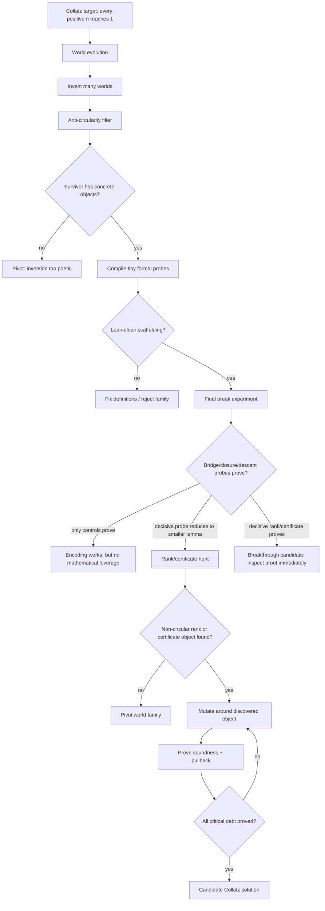

# Collatz World-Evolution Roadmap

This is Lima's current zoom-out map for deciding whether the world-evolution path is worth pursuing.

## Current Position

Lima has already shown that invented worlds can make formal contact with Lean/Aristotle. That is not a Collatz result. The remaining question is whether invention can produce a non-circular object that shrinks the proof burden.

Current best world:

```text
W-0273193499 / Alien State-Space Encoding 1
```

What it has done:

```text
encoded Collatz states -> proved scaffolding/simulation/bridge-shape controls ->
completed rank/certificate hunt -> killed naive scalar rank families ->
confirmed richer structural families are formalizable ->
proved local hybrid certificate language is Lean-clean
```

What it has not done:

```text
proved that the local hybrid certificates compose into a global coverage/descent theorem
```

## Flow Diagram



## Question Stack

1. Can the world define its objects without assuming Collatz?
2. Can the world simulate Collatz one step at a time?
3. Can the bridge back to natural numbers avoid restating the target?
4. Can a conditional descent/certificate theorem be proved?
5. Can Lima invent the actual rank/certificate object?
6. Is that object non-circular?
7. Does it reduce proof debt below the original theorem?
8. Can all critical bridge and closure debt be proved formally?

## Decision Gates

### Pursue

Continue this path if at least one of these happens:

```text
- A decisive bridge/closure/descent probe is proved.
- A decisive failed probe exposes a smaller named lemma.
- A non-circular certificate/rank/invariant candidate is produced.
- The same lineage survives mutation with decreasing proof debt.
```

### Pivot

Stop this world family if:

```text
- Only definitional/control probes prove.
- Hard probes simply restate global Collatz termination.
- The rank/certificate object is equivalent to reachability.
- Failures do not expose a smaller lemma than Collatz itself.
```

## Where We Are Now

```text
World evolution: passed
Scaffolding probes: passed
Final break experiment: mostly completed
Exact Collatz pullback target: blocked
Rank/certificate hunt: completed, but direct existence probe blocked
Candidate scalar rank-family gauntlet: completed, mostly negative
Structured rank-family wave: completed, mixed but informative
Hybrid certificate-family wave: completed, positive local syntax / negative coarse signature completeness
Current bottleneck: make local hybrid certificates compose into global proof compression
Next phase: compositional certificate calculus and coverage/descent hunt
```

## Next Phase

The next phase is not more broad invention, not another scalar-potential search, and not another local certificate-record test. The hybrid wave already proved the local language is expressible. The new target is composition:

```text
compositional hybrid certificate calculus combining:
- inverse-tree certificate extension
- parity-block grammar rather than one-step trace only
- valuation/residue constraints strong enough to prune branches
- explicit transport lemmas back to Collatz dynamics
- a well-founded complexity measure on certificate transformations
```

Success means local certificates can be extended, normalized, or pruned in a way that turns global trajectory questions into a smaller coverage theorem. Failure means the current encoding-world path probably lacks enough global leverage and should pivot to a different world family.
