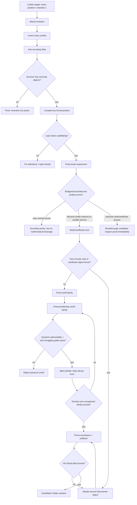

# Collatz World-Evolution Roadmap

This is Lima's current zoom-out map for deciding whether the world-evolution path is worth pursuing.

## Current Position

Lima has already shown that invented worlds can make formal contact with Lean/Aristotle. That is not a Collatz result. The remaining question is whether invention can produce a non-circular object that shrinks the proof burden.

Current best world:

```text
W-0273193499 / Cylinder-Pressure Extension
```

What it has done:

```text
encoded Collatz states -> proved scaffolding/simulation/bridge-shape controls ->
completed rank/certificate hunt -> killed naive scalar rank families ->
confirmed richer structural families are formalizable ->
pivoted away from local hybrid certificates ->
proved 2-adic cylinder-pressure language is Lean-clean
```

What it has not done:

```text
proved that bad-pressure cylinder families shrink to density zero under legal refinement
```

## Flow Diagram



## Question Stack

1. Can the world define its objects without assuming Collatz?
2. Can the world simulate Collatz one step at a time?
3. Can the bridge back to natural numbers avoid restating the target?
4. Can a conditional descent/certificate theorem be proved?
5. Can Lima invent the actual rank/certificate object?
6. Is that object non-circular?
7. Does it reduce proof debt below the original theorem?
8. Can all critical bridge and closure debt be proved formally?

## Decision Gates

### Pursue

Continue this path if at least one of these happens:

```text
- A decisive bridge/closure/descent probe is proved.
- A decisive failed probe exposes a smaller named lemma.
- A non-circular certificate/rank/invariant candidate is produced.
- The same lineage survives mutation with decreasing proof debt.
```

### Pivot

Stop this world family if:

```text
- Only definitional/control probes prove.
- Hard probes simply restate global Collatz termination.
- The rank/certificate object is equivalent to reachability.
- Failures do not expose a smaller lemma than Collatz itself.
```

## Where We Are Now

```text
World evolution: passed
Scaffolding probes: passed
Final break experiment: mostly completed
Exact Collatz pullback target: blocked
Rank/certificate hunt: completed, but direct existence probe blocked
Candidate scalar rank-family gauntlet: completed, mostly negative
Structured rank-family wave: completed, mixed but informative
Hybrid certificate-family wave: completed, positive local syntax / negative coarse signature completeness
Compositional certificate wave: completed, positive local composition / negative short-block descent
Coverage-normalization hunt: completed, coverage statements formalized but syntactic/forced-extension mechanism rejected
Cylinder-pressure wave: completed, dynamic admissibility and anti-smuggling gates passed
Current bottleneck: no bad-cylinder mass-decay or density-zero theorem yet
Next phase: cylinder-pressure globalization
```

## Next Phase

The pivot away from the current Alien State-Space / hybrid-certificate lineage has started. The first cylinder-pressure wave proved that 2-adic residue cylinders, dynamic parity admissibility, affine block transport, pressure accounting, legal refinement, and density-style bad-cylinder gates can be stated without directly assuming reachability.

```text
current candidate world family:
- 2-adic cylinder-pressure / density transport

next gates:
- legal split trees for dynamically admissible cylinders
- bad-cylinder mass decay under refinement
- pressure recovery after bad all-odd blocks
- density-zero exceptional-family theorem
```

Success in the next phase means this family produces a smaller named theorem than Collatz: roughly, that the dynamically admissible bad-pressure cylinders have vanishing density or must eventually refine into positive-pressure descendants. The retired hybrid certificate language remains useful as local syntax, but should no longer be the main proof strategy unless the cylinder-pressure mechanism needs it as subordinate bookkeeping.

This is not the final step before Collatz is solved. It is the first serious post-pivot route to a possible final-step theorem.
